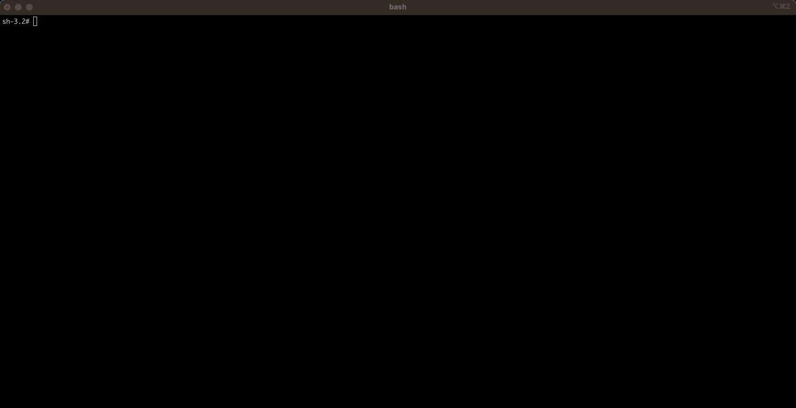

# Google Gemini NodeJS .TS Api

This project includes the boilerplate to interact with Gemini from a basic rest-api made in Node.js with Express + Typescript.

## Basic Requirements

1. Install Node.js [https://nodejs.org/en/download/](https://nodejs.org/en/download/)
2. Install `TypeScript`

```sh
npm install -g typescript
```

3. Install required dependencies

```sh
npm install
```

4. Get an Gemini API key: [https://makersuite.google.com/app/apikey](https://makersuite.google.com/app/apikey)
5. Update your `.env` file with your API_KEY

## Build and Run

To build js from typescript source.

```sh
npm run build
```

To start the server from the compiled folder (/dist).

```sh
npm run start
```

## Demo


